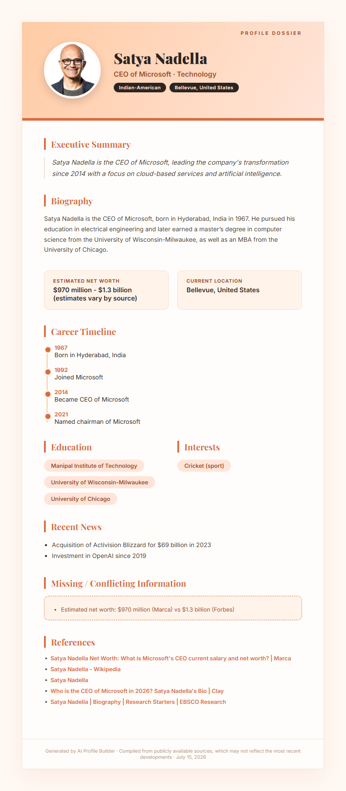

# AI-Powered Public Profile Builder

Generates structured public profiles using a multi-stage AI pipeline rather than a single LLM prompt.

## Features

- Multi-stage AI workflow
- Tavily web search
- TF-IDF retrieval ranking
- Structured JSON generation
- Missing/conflicting information detection
- Wikipedia image retrieval
- Beautiful HTML profile rendering
- PNG export
- Streamlit UI
- Logging & exception handling

## Live Demo
[https://ai-public-profile-maker.streamlit.app/]

## Architecture

```
User
   │
   ▼
Streamlit UI
   │
   ▼
Search Agent (Tavily)
   │
   ▼
TF-IDF Ranking
   │
   ▼
Profile Generator (Groq)
   │
   ▼
Wikipedia Image
   │
   ▼
Jinja2 Template
   │
   ▼
PNG Export
```

1. **Search Agent** (`agents/search.py`) — queries the Tavily API for public information about the person, using a targeted query designed to surface biography, education, career, location, and net worth data.
2. **Retrieval / Ranking** (`utils/ranking.py`) — this retrieval step ranks the search results using TF-IDF and cosine similarity so that only the most relevant documents are sent to the LLM, rather than raw dumped search results.
3. **Extraction Agent** (`agents/profile_generator.py`) — sends the ranked source content to Groq's Llama 3.3 70B model with a strict JSON schema and explicit rules: no fabrication, flag missing fields, flag conflicting facts (e.g. differing net worth figures) with both values and sources rather than silently picking one. Returns a validated structured JSON object before rendering.
4. **Image Service** (`services/image_service.py`) — fetches a properly attributed photo via Wikipedia's REST API.
5. **Renderer** (`render_profile.py`) — merges the structured JSON into a styled HTML template (`templates/profile_template.html`) via Jinja2, then converts it to a PNG using Playwright (headless Chromium).
6. **UI** (`app.py`) — Streamlit interface wrapping the full pipeline with live status updates per stage.

## Tech Stack

- Python
- Streamlit
- Tavily API
- Groq API
- Scikit-learn
- Jinja2
- Playwright
- python-dotenv

## Setup

```bash
git clone https://github.com/WaasifAI/AI_Profile_Maker.git
cd AI_Profile_Maker
python -m venv venv
venv\Scripts\activate   # Windows
pip install -r requirements.txt
playwright install chromium
```

Create a `.env` file in the root:
```
GROQ_API_KEY=your_key_here
TAVILY_API_KEY=your_key_here
```

## API Keys

- Groq → https://console.groq.com
- Tavily → https://tavily.com

## Run

```bash
streamlit run app.py
```

## Generated Profile



## Known Limitations

- Time-sensitive fields (net worth, citizenship status, current role) reflect the recency of the underlying public source pages, not real-time data — some sources are not regularly updated. The generated profile timestamps when it was compiled so this can be judged accordingly.
- Career timeline entries are limited to what appears in the top-ranked sources; entries are never fabricated to fill gaps.
- Wikipedia image fetch requires an exact or near-exact name match; obscure individuals without a Wikipedia page will show no photo.
- Public search quality depends on the credibility and availability of indexed web sources.

## Future Improvements

- LangGraph-based orchestration
- Parallel retrieval agents
- Source credibility scoring
- PDF export
- FastAPI backend
- React frontend
- User authentication
- Persistent profile history

## Sample Output
See `sample_output/satya_nadella_profile.png`
